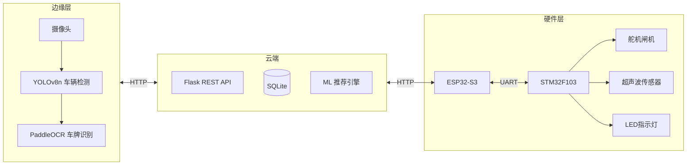

<p align="center">
  <h1 align="center">Smart Parking Lot — 智能停车场系统</h1>
  <p align="center"><strong>树莓派 Pi 5 + ESP32 + STM32 软硬件全栈方案</strong> — 边缘AI · 物联网 · 云服务</p>
  <p align="center">
    
    
    
    
    
    
  </p>
</p>

---

## 项目概述

本项目构建了一套完整的智能停车场解决方案，实现了**无人化、智能化**的停车场运营管理。系统采用 **"边缘计算 + 云服务 + Web 前端"** 三层架构，以 Raspberry Pi 5 作为边缘 AI 计算节点（YOLOv8n + PaddleOCR），ESP32-S3 作为通信上位机，STM32 作为底层硬件控制器。



### 核心功能

<table align="center">
<tr><th>模块</th><th>功能</th></tr>
<tr><td>车牌识别</td><td>YOLOv8n 车辆检测 → PaddleOCR 字符识别，边缘置信度 >= 0.85 直接使用，< 0.85 云端兜底</td></tr>
<tr><td>车位管理</td><td>STM32 超声波实时监测 102 个车位，毫秒级状态上报</td></tr>
<tr><td>智能推荐</td><td>协同过滤算法，结合用户历史偏好 + 新能源绿牌专属充电区推荐</td></tr>
<tr><td>自动计费</td><td>日/夜阶梯费率，绿牌 8 折优惠，管理面板实时修改即时生效</td></tr>
<tr><td>实时推送</td><td>WebSocket 推送车位状态、入场/出场告警、识别画面流</td></tr>
<tr><td>安全审计</td><td>JWT 双令牌认证，全操作审计日志，接口限流防刷</td></tr>
</table>

---

## 演示视频

https://github.com/user-attachments/assets/2877499e-d197-4e0b-80ea-34c265f1a3d3

---

## 技术栈

<table align="center">
<tr><th>层级</th><th>技术</th><th>版本</th></tr>
<tr><td>后端</td><td>Flask + SQLAlchemy</td><td>3.1 / 3.1</td></tr>
<tr><td>认证</td><td>JWT HS256 (access 2h + refresh 7d)</td><td>—</td></tr>
<tr><td>实时通信</td><td>flask-socketio (WebSocket)</td><td>5.6</td></tr>
<tr><td>边缘AI</td><td>YOLOv8n (ultralytics) + PaddleOCR</td><td>8.4 / 3.6</td></tr>
<tr><td>机器学习</td><td>scikit-learn (MLP + 协同过滤)</td><td>1.9</td></tr>
<tr><td>云端OCR</td><td>腾讯云 LicensePlateOCR (兜底)</td><td>3.1 SDK</td></tr>
<tr><td>前端</td><td>Vue 3 + Element Plus + ECharts</td><td>—</td></tr>
<tr><td>硬件协议</td><td>CRC-16 + STM32 AA55 帧</td><td>—</td></tr>
<tr><td>数据库</td><td>SQLite (dev) / PostgreSQL (prod)</td><td>—</td></tr>
</table>

---

## 快速开始

### 环境要求

- **Python** 3.13+
- 可选：CUDA GPU / Pi5（边缘AI）、ESP32-S3 / STM32 / K210（硬件）

### 安装

```bash
git clone https://github.com/Yangling777/Parking-lot.git
cd Parking-lot
python setup.py
```

### 启动

```bash
# 开发模式
python code/app.py

# 启用 WebSocket 推送
# Windows: set ENABLE_SOCKETIO=1 && python code/app.py
# Linux/Mac: ENABLE_SOCKETIO=1 python code/app.py

# 生产模式
gunicorn -w 4 -b 0.0.0.0:5000 "code.app:create_app()"
```

### 访问地址

<table align="center">
<tr><th>页面</th><th>地址</th><th>说明</th></tr>
<tr><td>登录页</td><td><code>http://localhost:5000</code></td><td>用户登录 / 注册</td></tr>
<tr><td>用户端</td><td><code>http://localhost:5000/user</code></td><td>车位推荐、预约、支付、充电</td></tr>
<tr><td>管理端</td><td><code>http://localhost:5000/admin</code></td><td>仪表盘、审批、计费规则、硬件管理</td></tr>
<tr><td>模拟器</td><td><code>http://localhost:5000/simulator</code></td><td>虚拟闸机、车位模拟</td></tr>
</table>

### 测试账号

<table align="center">
<tr><th>角色</th><th>账号</th><th>密码</th><th>说明</th></tr>
<tr><td>普通用户</td><td><code>13800138000</code></td><td><code>123456</code></td><td>车牌：京A·88888</td></tr>
<tr><td>管理员</td><td><code>admin</code></td><td><code>admin</code></td><td>最高权限</td></tr>
<tr><td>安保人员</td><td><code>anbao</code></td><td><code>anbao</code></td><td>只读大盘</td></tr>
<tr><td>测试用户</td><td><code>test</code></td><td><code>123456</code></td><td>免除防刷限制</td></tr>
<tr><td>物业总管</td><td><code>wuye</code></td><td><code>wuye</code></td><td>管理权限</td></tr>
</table>

---

## 项目结构

```
Parking-lot/
├── code/                          # 后端应用
│   ├── app.py                     # Flask 入口 + 虚拟仿真引擎
│   ├── extensions.py              # JWT / CRC16 / 计费引擎 / 审计日志
│   ├── models.py                  # 8 张 ORM 数据表
│   ├── database_init.py           # 种子数据 + 初始化
│   ├── routes/                    
│   │   ├── auth_routes.py         # JWT 认证
│   │   ├── admin_routes.py        # 管理面板
│   │   ├── user_routes.py         # 用户端
│   │   ├── hardware_routes.py     # 硬件接口
│   │   └── ai_parking_engine.py   # ML 推荐引擎
│   ├── edge/                      
│   │   ├── yolo_detector.py       # YOLOv8n 车辆检测器
│   │   ├── ocr_engine.py          # PaddleOCR 车牌识别
│   │   ├── plate_recognizer.py    # 识别管线
│   │   ├── stm32_comm.py          # STM32 AA55 帧协议
│   │   ├── esp32_bridge.py        # ESP32 WiFi 桥接
│   │   ├── k210_compat.py         # K210 兼容适配器
│   │   ├── main_bridge.py         # 串口桥接 (HyperLPR3)
│   │   ├── camera_module.py       # 摄像头串口采集
│   │   ├── time_module.py         # ESP32 时钟同步
│   │   └── webcam_simulator.py    # PC 摄像头模拟器
│   ├── templates/                 # Vue 3 + Element Plus 前端
│   └── static/                    
├── hardware/                      # 硬件代码
│   ├── README.md                  # 硬件架构与接线
│   ├── pi5/                       # Pi 5 边缘节点
│   │   ├── main.py                # 主程序
│   │   ├── config.py              # 部署配置
│   │   └── install.sh             # 一键安装脚本
│   └── stm32/                     # STM32 下位机固件
│       ├── main.c                 # 超声波 / 舵机 / LED / UART
│       └── protocol.h             # 通信协议定义
├── media/                         # 演示媒体
│   ├── demo.gif                   # 演示 GIF
│   └── demo.mp4                   # 完整视频
├── tools/                         # 工具
│   ├── plate_generator.py         # 车牌生成器
│   └── image_converter/           # 图片转 C 数组
├── docs/                          # 文档
├── setup.py                       # 一键配置环境
├── requirements.txt               
└── README.md                      
```

---

## API 接口

### 认证 `/api/auth/`

<table align="center">
<tr><th>方法</th><th>路径</th><th>说明</th></tr>
<tr><td><code>POST</code></td><td><code>/api/auth/login</code></td><td>JWT 登录 -> access + refresh token</td></tr>
<tr><td><code>POST</code></td><td><code>/api/auth/register</code></td><td>用户注册（待管理员审批）</td></tr>
<tr><td><code>POST</code></td><td><code>/api/auth/refresh</code></td><td>刷新令牌（旧 token 加入黑名单）</td></tr>
<tr><td><code>POST</code></td><td><code>/api/auth/logout</code></td><td>登出（当前 token 加入黑名单）</td></tr>
</table>

### 用户 `/api/user/`

<table align="center">
<tr><th>方法</th><th>路径</th><th>说明</th></tr>
<tr><td><code>GET</code></td><td><code>/api/user/info</code></td><td>获取个人信息</td></tr>
<tr><td><code>POST</code></td><td><code>/api/user/login</code></td><td>手机号登录（兼容旧版）</td></tr>
<tr><td><code>GET</code></td><td><code>/api/user/recommend</code></td><td>AI 推荐车位（协同过滤）</td></tr>
<tr><td><code>POST</code></td><td><code>/api/user/reserve</code></td><td>预约车位</td></tr>
<tr><td><code>POST</code></td><td><code>/api/user/cancel_reserve</code></td><td>取消预约</td></tr>
<tr><td><code>POST</code></td><td><code>/api/user/pay</code></td><td>支付停车费</td></tr>
<tr><td><code>POST</code></td><td><code>/api/user/start_charge</code></td><td>开始充电</td></tr>
<tr><td><code>POST</code></td><td><code>/api/user/stop_charge</code></td><td>停止充电</td></tr>
<tr><td><code>GET</code></td><td><code>/api/user/my_records</code></td><td>历史停车记录</td></tr>
<tr><td><code>GET</code></td><td><code>/api/user/my_charging_records</code></td><td>充电记录</td></tr>
<tr><td><code>POST</code></td><td><code>/api/user/submit_mod_request</code></td><td>提交信息变更申请</td></tr>
<tr><td><code>POST</code></td><td><code>/api/user/change_password</code></td><td>修改密码</td></tr>
</table>

### 管理 `/api/admin/`

<table align="center">
<tr><th>方法</th><th>路径</th><th>说明</th></tr>
<tr><td><code>GET</code></td><td><code>/api/admin/dashboard</code></td><td>仪表盘（车位 / 营收 / 趋势）</td></tr>
<tr><td><code>GET</code></td><td><code>/api/admin/users</code></td><td>用户列表</td></tr>
<tr><td><code>POST</code></td><td><code>/api/admin/user/update</code></td><td>创建 / 更新用户</td></tr>
<tr><td><code>POST</code></td><td><code>/api/admin/user/delete</code></td><td>删除用户</td></tr>
<tr><td><code>POST</code></td><td><code>/api/admin/user/approve</code></td><td>审批注册申请</td></tr>
<tr><td><code>GET</code></td><td><code>/api/admin/mod_requests</code></td><td>变更申请列表</td></tr>
<tr><td><code>POST</code></td><td><code>/api/admin/handle_mod_request</code></td><td>审批 / 拒绝变更</td></tr>
<tr><td><code>GET / POST</code></td><td><code>/api/admin/price_rules</code></td><td>计费规则 CRUD</td></tr>
<tr><td><code>DELETE</code></td><td><code>/api/admin/price_rules/&lt;id&gt;</code></td><td>删除计费规则</td></tr>
<tr><td><code>GET</code></td><td><code>/api/admin/audit_logs</code></td><td>操作审计日志</td></tr>
<tr><td><code>GET</code></td><td><code>/api/admin/records</code></td><td>全场停车记录</td></tr>
<tr><td><code>POST</code></td><td><code>/api/admin/clear_all</code></td><td>一键清空放行</td></tr>
<tr><td><code>GET</code></td><td><code>/api/admin/hardware/topology</code></td><td>硬件拓扑图</td></tr>
<tr><td><code>POST</code></td><td><code>/api/admin/hardware/control</code></td><td>远程控制闸机 / LED</td></tr>
<tr><td><code>POST</code></td><td><code>/api/admin/update_simulation</code></td><td>调整虚拟仿真参数</td></tr>
</table>

### 硬件 `/api/hardware/`

<table align="center">
<tr><th>方法</th><th>路径</th><th>说明</th></tr>
<tr><td><code>POST</code></td><td><code>/api/hardware/edge/upload</code></td><td>Pi5 / K210 上传识别结果</td></tr>
<tr><td><code>GET</code></td><td><code>/api/hardware/edge/config</code></td><td>边缘节点拉取配置</td></tr>
<tr><td><code>POST</code></td><td><code>/api/hardware/heartbeat</code></td><td>设备心跳保活</td></tr>
<tr><td><code>GET</code></td><td><code>/api/hardware/devices</code></td><td>设备列表</td></tr>
<tr><td><code>POST</code></td><td><code>/api/hardware/stm32/sensor</code></td><td>STM32 超声波传感器数据</td></tr>
<tr><td><code>POST</code></td><td><code>/api/hardware/stm32/heartbeat</code></td><td>STM32 心跳</td></tr>
<tr><td><code>POST</code></td><td><code>/api/hardware/stm32/command</code></td><td>闸机 / LED / 舵机指令</td></tr>
<tr><td><code>POST</code></td><td><code>/api/hardware/esp32/bridge</code></td><td>ESP32 协议桥接</td></tr>
<tr><td><code>POST</code></td><td><code>/api/hardware/protocol</code></td><td>CRC-16 硬件协议</td></tr>
<tr><td><code>POST</code></td><td><code>/api/hardware/upload_image</code></td><td>直接上传图像识别</td></tr>
<tr><td><code>POST</code></td><td><code>/api/hardware/update_slot</code></td><td>物理车位状态更新</td></tr>
</table>

### 系统 `/api/system/`

<table align="center">
<tr><th>方法</th><th>路径</th><th>说明</th></tr>
<tr><td><code>GET</code></td><td><code>/api/system/status</code></td><td>系统状态（占用率等）</td></tr>
<tr><td><code>GET</code></td><td><code>/api/system/logs</code></td><td>实时系统日志</td></tr>
</table>

---

## 计费规则

<table align="center">
<tr><th>时段</th><th>费率</th><th>封顶</th></tr>
<tr><td>白天 8:00 - 20:00</td><td>5 / 小时</td><td>50 / 天</td></tr>
<tr><td>夜间 20:00 - 8:00</td><td>3 / 小时</td><td>20 / 夜</td></tr>
<tr><td>入场 30 分钟内</td><td><b>免费</b></td><td>—</td></tr>
<tr><td>新能源绿牌</td><td><b>8 折</b></td><td>—</td></tr>
</table>

> 计费规则可通过管理面板 `价格规则` 页面实时修改，即时生效，无需重启服务。

---

## 硬件架构

详见 [hardware/README.md](hardware/README.md)

<table align="center">
<tr><th>设备</th><th>连接</th><th>功能</th></tr>
<tr><td>Pi 5 CSI Camera</td><td>GPIO CSI</td><td>车辆抓拍</td></tr>
<tr><td>Pi 5 继电器</td><td>GPIO 22</td><td>闸机抬杆</td></tr>
<tr><td>Pi 5 LED</td><td>GPIO 17 / 27</td><td>通行指示（绿 / 红）</td></tr>
<tr><td>STM32 HC-SR04 x 8</td><td>GPIO</td><td>车位超声波测距</td></tr>
<tr><td>STM32 舵机</td><td>PB0 PWM</td><td>闸机物理控制</td></tr>
<tr><td>STM32 LED</td><td>PB12 / PB13 / PB14</td><td>车位状态指示灯</td></tr>
<tr><td>ESP32 - STM32</td><td>UART 115200</td><td>协议转换</td></tr>
<tr><td>ESP32 - 云端</td><td>WiFi 2.4G</td><td>HTTP 通信</td></tr>
</table>

---

## JWT 认证

```bash
# 1. 登录获取令牌
curl -X POST http://localhost:5000/api/auth/login \
  -H "Content-Type: application/json" \
  -d '{"phone": "13800138000", "password": "123456"}'

# 响应
{
  "code": 200,
  "data": {
    "access_token": "eyJhbGciOiAiSFMyNTYi...",
    "refresh_token": "eyJhbGciOiAiSFMyNTYi...",
    "expires_in": 7200,
    "user": { "id": 1, "username": "张三", "role": "user" }
  }
}

# 2. 携带令牌访问受保护接口
curl -H "Authorization: Bearer eyJhbGci..." http://localhost:5000/api/user/info

# 3. 令牌刷新（旧 refresh_token 失效）
curl -X POST http://localhost:5000/api/auth/refresh \
  -H "Content-Type: application/json" \
  -d '{"refresh_token": "eyJhbGciOiAiSFMyNTYi..."}'
```

### 令牌机制

<table align="center">
<tr><th>类型</th><th>有效期</th><th>用途</th></tr>
<tr><td><code>access_token</code></td><td>2 小时</td><td>访问所有受保护 API</td></tr>
<tr><td><code>refresh_token</code></td><td>7 天</td><td>换取新的 access_token（刷新后旧 token 作废）</td></tr>
<tr><td>黑名单</td><td>内存</td><td>logout / refresh 时加入，立即失效</td></tr>
</table>

---

## 开发指南

```bash
# 仅安装后端依赖
python setup.py --backend

# 环境检查
python setup.py --check

# 添加新硬件节点
# 1. 在 code/edge/ 下创建模块 (参考 k210_compat.py)
# 2. 在 hardware_routes.py 注册路由
# 3. 在 models.py 的 HardwareDevice.device_type 注册类型
```

### 环境变量

<table align="center">
<tr><th>变量</th><th>默认值</th><th>说明</th></tr>
<tr><td><code>JWT_SECRET</code></td><td>内置</td><td>JWT 签名密钥（生产环境务必覆盖）</td></tr>
<tr><td><code>SECRET_KEY</code></td><td>内置</td><td>Flask Session 密钥</td></tr>
<tr><td><code>ENABLE_SOCKETIO</code></td><td><code>0</code></td><td>设为 <code>1</code> 启用 WebSocket 实时推送</td></tr>
<tr><td><code>TENCENT_SECRET_ID</code></td><td><code>YOUR_...</code></td><td>腾讯云 OCR SecretId</td></tr>
<tr><td><code>TENCENT_SECRET_KEY</code></td><td><code>YOUR_...</code></td><td>腾讯云 OCR SecretKey</td></tr>
</table>

---

## License

[MIT](LICENSE) © 2026 Yangling777
