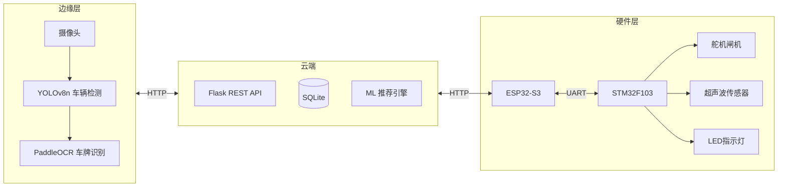

<p align="center">
  <h1 align="center">Smart Parking Lot（软硬件结合 树莓派pi5 esp32 stm32）</h1>
  <p align="center"><strong>智能停车场管理系统</strong> — 边缘AI + 物联网 + 云服务</p>
  <p align="center">
    
    
    
    
    
    
  </p>
</p>

---

## 项目概述

本项目构建了一套完整的智能停车场解决方案，实现了**无人化、智能化**的停车场运营管理。系统采用 **"边缘计算 + 云服务 + Web 前端"** 三层架构，以 Raspberry Pi 5 作为边缘 AI 计算节点（YOLOv8n + PaddleOCR），ESP32-S3 作为通信上位机，STM32 作为底层硬件控制器。



### 核心功能

| 模块 | 功能 |
|:---:|---|
| 车牌识别 | YOLOv8n 车辆检测 → PaddleOCR 字符识别，边缘置信度 ≥ 0.85 直接使用，< 0.85 云端兜底 |
| 车位管理 | STM32 超声波实时监测 102 个车位，毫秒级状态上报 |
| 智能推荐 | 协同过滤算法，结合用户历史偏好 + 新能源绿牌专属充电区推荐 |
| 自动计费 | 日/夜阶梯费率，绿牌 8 折优惠，管理面板实时修改即时生效 |
| 实时推送 | WebSocket 推送车位状态、入场/出场告警、识别画面流 |
| 安全审计 | JWT 双令牌认证，全操作审计日志，接口限流防刷 |

---

## 技术栈

| 层级 | 技术 | 版本 |
|:---:|---|---|
| 后端 | Flask + SQLAlchemy | 3.1 / 3.1 |
| 认证 | JWT HS256 (access 2h + refresh 7d) | — |
| 实时通信 | flask-socketio (WebSocket) | 5.6 |
| 边缘AI | YOLOv8n (ultralytics) + PaddleOCR | 8.4 / 3.6 |
| 机器学习 | scikit-learn (MLP + 协同过滤) | 1.9 |
| 云端OCR | 腾讯云 LicensePlateOCR (兜底) | 3.1 SDK |
| 前端 | Vue 3 + Element Plus + ECharts | — |
| 硬件协议 | CRC-16 + STM32 AA55 帧 | — |
| 数据库 | SQLite (dev) / PostgreSQL (prod) | — |

---

## 快速开始

### 环境要求

- **Python** 3.13+
- 可选：CUDA GPU / Pi5（边缘AI）、ESP32-S3 / STM32 / K210（硬件）

### 安装

```bash
git clone https://github.com/Yangling777/Parking-lot.git
cd Parking-lot
python setup.py
```

### 启动

```bash
# 开发模式
python code/app.py

# 启用 WebSocket 推送
# Windows: set ENABLE_SOCKETIO=1 && python code/app.py
# Linux/Mac: ENABLE_SOCKETIO=1 python code/app.py

# 生产模式
gunicorn -w 4 -b 0.0.0.0:5000 "code.app:create_app()"
```

### 访问地址

| 页面 | 地址 | 说明 |
|:---:|---|---|
| 登录页 | http://localhost:5000 | 用户登录 / 注册 |
| 用户端 | http://localhost:5000/user | 车位推荐、预约、支付、充电 |
| 管理端 | http://localhost:5000/admin | 仪表盘、审批、计费规则、硬件管理 |
| 模拟器 | http://localhost:5000/simulator | 虚拟闸机、车位模拟 |

### 测试账号

| 角色 | 账号 | 密码 | 说明 |
|:---:|---|---|---|
| 普通用户 | `13800138000` | `123456` | 车牌：京A·88888 |
| 管理员 | `admin` | `admin` | 最高权限 |
| 安保人员 | `anbao` | `anbao` | 只读大盘 |
| 测试用户 | `test` | `123456` | 免除防刷限制 |
| 物业总管 | `wuye` | `wuye` | 管理权限 |

---

## 项目结构

```
Parking-lot/
├── code/                          # 后端应用
│   ├── app.py                     # Flask 入口 + 虚拟仿真引擎
│   ├── extensions.py              # JWT / CRC16 / 计费引擎 / 审计日志
│   ├── models.py                  # 8 张 ORM 数据表
│   ├── database_init.py           # 种子数据 + 初始化
│   ├── routes/                    
│   │   ├── auth_routes.py         # JWT 认证 (login / register / refresh / logout)
│   │   ├── admin_routes.py        # 管理面板 (用户审批 / 计费规则 / 硬件管理)
│   │   ├── user_routes.py         # 用户端 (预约 / 支付 / 充电 / 记录)
│   │   ├── hardware_routes.py     # 硬件接口 (识别 / 传感器 / 心跳 / 协议)
│   │   └── ai_parking_engine.py   # ML 推荐引擎 (MLP + 协同过滤)
│   ├── edge/                      
│   │   ├── yolo_detector.py       # YOLOv8n 车辆检测器 (ONNX 降级)
│   │   ├── ocr_engine.py          # PaddleOCR 车牌识别 (腾讯云兜底)
│   │   ├── plate_recognizer.py    # 识别管线 (检测 + OCR + 去抖)
│   │   ├── stm32_comm.py          # STM32 AA55 帧协议 + 虚拟仿真器
│   │   ├── esp32_bridge.py        # ESP32 WiFi 桥接 (队列 / 重试)
│   │   ├── k210_compat.py         # K210 兼容适配器
│   │   ├── main_bridge.py         # 串口桥接 (HyperLPR3)
│   │   ├── camera_module.py       # 摄像头串口采集
│   │   ├── time_module.py         # ESP32 时钟同步
│   │   └── webcam_simulator.py    # PC 摄像头模拟器
│   ├── templates/                 # Vue 3 + Element Plus 前端
│   └── static/                    
├── hardware/                      # 硬件代码
│   ├── README.md                  # 硬件架构、接线图、数据流
│   ├── pi5/                       # Pi 5 边缘节点
│   │   ├── main.py                # 主程序 (检测 + 识别 + 控制)
│   │   ├── config.py              # 部署配置
│   │   └── install.sh             # 一键安装脚本
│   └── stm32/                     # STM32 下位机固件
│       ├── main.c                 # 超声波 / 舵机 / LED / UART
│       └── protocol.h             # 通信协议定义
├── tools/                         # 工具
│   ├── plate_generator.py         # 车牌生成器
│   └── image_converter/           # 图片转 C 数组工具
├── docs/                          # 文档
├── setup.py                       # 一键配置环境
├── requirements.txt               
└── README.md                      
```

---

## API 接口

### 认证 `/api/auth/`

| 方法 | 路径 | 说明 |
|:---:|---|---|
| `POST` | `/api/auth/login` | JWT 登录 → access + refresh token |
| `POST` | `/api/auth/register` | 用户注册（待管理员审批） |
| `POST` | `/api/auth/refresh` | 刷新令牌（旧 token 加入黑名单） |
| `POST` | `/api/auth/logout` | 登出（当前 token 加入黑名单） |

### 用户 `/api/user/`

| 方法 | 路径 | 说明 |
|:---:|---|---|
| `GET` | `/api/user/info` | 获取个人信息 |
| `POST` | `/api/user/login` | 手机号登录（兼容旧版） |
| `GET` | `/api/user/recommend` | AI 推荐车位（协同过滤） |
| `POST` | `/api/user/reserve` | 预约车位 |
| `POST` | `/api/user/cancel_reserve` | 取消预约 |
| `POST` | `/api/user/pay` | 支付停车费 |
| `POST` | `/api/user/start_charge` | 开始充电 |
| `POST` | `/api/user/stop_charge` | 停止充电 |
| `GET` | `/api/user/my_records` | 历史停车记录 |
| `GET` | `/api/user/my_charging_records` | 充电记录 |
| `POST` | `/api/user/submit_mod_request` | 提交信息变更申请 |
| `POST` | `/api/user/change_password` | 修改密码 |

### 管理 `/api/admin/`

| 方法 | 路径 | 说明 |
|:---:|---|---|
| `GET` | `/api/admin/dashboard` | 仪表盘（车位 / 营收 / 趋势） |
| `GET` | `/api/admin/users` | 用户列表 |
| `POST` | `/api/admin/user/update` | 创建 / 更新用户 |
| `POST` | `/api/admin/user/delete` | 删除用户 |
| `POST` | `/api/admin/user/approve` | 审批注册申请 |
| `GET` | `/api/admin/mod_requests` | 变更申请列表 |
| `POST` | `/api/admin/handle_mod_request` | 审批 / 拒绝变更 |
| `GET/POST` | `/api/admin/price_rules` | 计费规则 CRUD |
| `DELETE` | `/api/admin/price_rules/<id>` | 删除计费规则 |
| `GET` | `/api/admin/audit_logs` | 操作审计日志 |
| `GET` | `/api/admin/records` | 全场停车记录 |
| `POST` | `/api/admin/clear_all` | 一键清空放行 |
| `GET` | `/api/admin/hardware/topology` | 硬件拓扑图 |
| `POST` | `/api/admin/hardware/control` | 远程控制闸机 / LED |
| `POST` | `/api/admin/update_simulation` | 调整虚拟仿真参数 |

### 硬件 `/api/hardware/`

| 方法 | 路径 | 说明 |
|:---:|---|---|
| `POST` | `/api/hardware/edge/upload` | Pi5 / K210 上传识别结果 |
| `GET` | `/api/hardware/edge/config` | 边缘节点拉取配置 |
| `POST` | `/api/hardware/heartbeat` | 设备心跳保活 |
| `GET` | `/api/hardware/devices` | 设备列表 |
| `POST` | `/api/hardware/stm32/sensor` | STM32 超声波传感器数据 |
| `POST` | `/api/hardware/stm32/heartbeat` | STM32 心跳 |
| `POST` | `/api/hardware/stm32/command` | 闸机 / LED / 舵机指令 |
| `POST` | `/api/hardware/esp32/bridge` | ESP32 协议桥接 |
| `POST` | `/api/hardware/protocol` | CRC-16 硬件协议 (ENTRY/EXIT/SLOT/TIME) |
| `POST` | `/api/hardware/upload_image` | 直接上传图像识别 |
| `POST` | `/api/hardware/update_slot` | 物理车位状态更新 |

### 系统 `/api/system/`

| 方法 | 路径 | 说明 |
|:---:|---|---|
| `GET` | `/api/system/status` | 系统状态（占用率等） |
| `GET` | `/api/system/logs` | 实时系统日志 |

---

## 计费规则

| 时段 | 费率 | 封顶 |
|:---:|---|---|
| 白天 8:00 – 20:00 | ¥5 / 小时 | ¥50 / 天 |
| 夜间 20:00 – 8:00 | ¥3 / 小时 | ¥20 / 夜 |
| 入场 30 分钟内 | **免费** | — |
| 新能源绿牌 | **8 折** | — |

> 计费规则可通过管理面板 `价格规则` 页面实时修改，即时生效，无需重启服务。

---

## 硬件架构

详见 [hardware/README.md](hardware/README.md)

| 设备 | 连接 | 功能 |
|:---:|---|---|
| Pi 5 CSI Camera | GPIO CSI | 车辆抓拍 |
| Pi 5 继电器 | GPIO 22 | 闸机抬杆 |
| Pi 5 LED | GPIO 17 / 27 | 通行指示（绿 / 红） |
| STM32 HC-SR04 × 8 | GPIO | 车位超声波测距 |
| STM32 舵机 | PB0 PWM | 闸机物理控制 |
| STM32 LED | PB12 / PB13 / PB14 | 车位状态指示灯 |
| ESP32 ↔ STM32 | UART 115200 | 协议转换 |
| ESP32 ↔ 云端 | WiFi 2.4G | HTTP 通信 |

---

## JWT 认证

```bash
# 1. 登录获取令牌
curl -X POST http://localhost:5000/api/auth/login \
  -H "Content-Type: application/json" \
  -d '{"phone": "13800138000", "password": "123456"}'

# 响应
{
  "code": 200,
  "data": {
    "access_token": "eyJhbGciOiAiSFMyNTYi...",
    "refresh_token": "eyJhbGciOiAiSFMyNTYi...",
    "expires_in": 7200,
    "user": {
      "id": 1,
      "username": "张三",
      "phone": "13800138000",
      "plate_number": "京A·88888",
      "role": "user"
    }
  }
}

# 2. 携带令牌访问受保护接口
curl -H "Authorization: Bearer eyJhbGci..." \
  http://localhost:5000/api/user/info

# 3. 令牌刷新（旧 refresh_token 失效）
curl -X POST http://localhost:5000/api/auth/refresh \
  -H "Content-Type: application/json" \
  -d '{"refresh_token": "eyJhbGciOiAiSFMyNTYi..."}'
```

### 令牌机制

| 类型 | 有效期 | 用途 |
|:---:|:---:|---|
| `access_token` | 2 小时 | 访问所有受保护 API |
| `refresh_token` | 7 天 | 换取新的 access_token（一次性，刷新后旧 token 作废） |
| 黑名单 | 内存 | logout / refresh 时加入，立即失效 |

---

## 开发指南

```bash
# 仅安装后端依赖
python setup.py --backend

# 环境检查
python setup.py --check

# 添加新硬件节点
# 1. 在 code/edge/ 下创建模块 (参考 k210_compat.py)
# 2. 在 hardware_routes.py 注册路由
# 3. 在 models.py 的 HardwareDevice.device_type 注册类型
```

### 环境变量

| 变量 | 默认值 | 说明 |
|:---:|---|---|
| `JWT_SECRET` | 内置 | JWT 签名密钥（生产环境务必覆盖） |
| `SECRET_KEY` | 内置 | Flask Session 密钥 |
| `ENABLE_SOCKETIO` | `0` | 设为 `1` 启用 WebSocket 实时推送 |
| `TENCENT_SECRET_ID` | `YOUR_...` | 腾讯云 OCR SecretId |
| `TENCENT_SECRET_KEY` | `YOUR_...` | 腾讯云 OCR SecretKey |

---

## License

[MIT](LICENSE) © 2026 Yangling777
